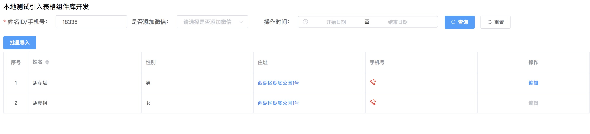

>components => tablelist基于element-ui对table表格的二次封装，一个快速生成查询列表的封装组件

**注意**：本包是vue项目；全局引入: 本包需依赖element-ui组件库。

##### 安装使用
```js
// 添加项目依赖： npm install table-form-list -S
// main.js中引入
1. import router from "./router";
2. import ElementUi from 'element-ui';
3. import "element-ui/lib/theme-chalk/index.css";
4. import TableFormList from "table-form-list"
5. Vue.use(TableFormList);
```

> 灵活使用，复制项目文件中的lib/TableFormList.vue文件在自己项目中，方便更改扩展



##### 使用案例
- 指定表格的数据源 `dataSource` 为一个数组，配置相关属性json；

```vue
<template>
  <div>
    <span>本地测试引入表格组件库开发</span>
    <br />
    <TableList
      border
      :options="options"
      :value="formVal"
      :rules="rules"
      :tableSearch="tableSearch"
      :columns="columns"
      :dataSource="dataSource"
      :exportBut="exportBut(this)"
      :operates="operates(this)"
    />
  </div>
</template>

<script>
// 搜索设置
const tableSearch = [
  {
    label: "姓名ID/手机号",
    inputType: "number",
    maxlength: 11,
    value: "name",
    rulesLength: true,
    labelProps: {
      "label-width": "130"
    }
  },
  {
    type: "select",
    label: "是否添加微信",
    value: "joinWeChatStatus",
    children: [
      {
        label: "未添加",
        value: "1"
      },
      {
        label: "已添加",
        value: "0"
      }
    ]
  },
  {
    type: "picker",
    label: "操作时间",
    value: "operate",
    props: {
      size: "mini",
      type: "datetimerange",
      "range-separator": "至",
      "start-placeholder": "开始日期",
      "end-placeholder": "结束日期",
      "value-format": "timestamp"
    }
  }
];

// 表格头设置
const columns = [
  {
    label: "姓名",
    prop: "name",
    props: {
      sortable: "sortable"
    }
  },
  {
    label: "性别",
    prop: "sex",
    formatter: (row, column, index) => {
      return row.sex === 0 ? "男" : "女";
    }
  },
  {
    label: "住址",
    prop: "address",
    newjump: (row, columns, index) => {
      return `www.baidu.com/studentInfo/index/${row.accountId}`;
    }
  },
  {
    label: "手机号",
    render: (h, parmas) => {
      return [
        h("i", {
          class: "el-icon-phone-outline",
          style: "fontSize: 16px; color: red"
        }),
        h("span", parmas.row.mobileNum)
      ];
    }
  }
];

// 表格操作按钮
const operates = that => [
  {
    label: "编辑",
    isShow: row => {
      return row.status !== 2;
    },
    disabled: row => {
      return row.disabled === 2;
    },
    method: row => {
      that.handleNewJump(row);
    }
  }
];

// 服务器请求返回值
const dataSource = [
  {
    key: "1",
    name: "胡彦斌",
    age: 32,
    sex: 0,
    address: "西湖区湖底公园1号"
  },
  {
    key: "2",
    name: "胡彦祖",
    age: 42,
    sex: 1,
    disabled: 2,
    address: "西湖区湖底公园1号"
  }
];

// 表格扩展按钮
const exportBut = (that) => [{
  title: '批量导入',
  method: () => that.handleBatchCourse()
}]

export default {
  data() {
    return {
      columns,
      operates,
      dataSource,
      tableSearch,
      exportBut,
      formVal: {
        name: 18335
      },
      options: {
        index: true,
        labelIndex: '序号'
      },
      rules: {
        name: [
          { required: true, message: "请填写学生ID", trigger: "blur" }
        ]
      }
    };
  },

  methods: {
    handleBatchCourse() {
      console.log('点击批量导入按钮')
    }
  }
};
</script>
```
##### API使用

##### TableList

| 参数 | 说明 | 类型 | 默认值 | 必填项
| --- | --- | --- | --- | --- |
| index | 是否显示该行索引 | String | - | 否
| border | 是否展示外边框和列边框 | Boolean | false | 否
| loading | 页面是否加载中 | Boolean | false | 否
| options | table参数扩展属性（复选框等）[Table Attributes](https://element.eleme.cn/2.8/#/zh-CN/component/table) | Object | - | 否
| columns | 表格列的配置描述，表头部分 | Array\[] | - | 是
| dataSource | 数据数组 | Array\[] | - | 是
| pagination | 分页的配置项 | Object | - | 否
| dataTotal | 数据总数 | Number | 0 | 否
| operates | 操作列表按钮 | Array\[] | - | 否
| exportBut | 列表导出、批量等按钮 | Array\[] | - | 否
| tableSearch | 开始表格搜索 | Array\[] | - | 否


##### Columns

列描述数据对象，是 columns 中的一项，与Element-Ui Columns 使用相同的 API在props中填写。使用用法：

| 参数 | 说明 | 类型 | 默认值 | 必填项
| --- | --- | --- | --- | --- |
| label | 列头显示文字 | String | - | 是
| prop | 列数据在数据项中对应的 key | String | - | 否
| align | 设置列的对齐方式 | 'left' 'right' 'center' | 'left' | 否
| width | 列宽度 | string number | - | 否
| props | 列表参数扩展属性[Table-column Attributes](https://element.eleme.cn/2.8/#/zh-CN/component/table) | Object | - | 否
| render | 生成复杂数据的渲染函数，参数分别为createElement，当前行数据 | Function(h, record) {} | - | 否
| formatter | 数据格式化 | Function(row, columns, index) {} | - | 否 
| newjump | url页面跳转 | Function(row, columns, index) {} | - | 否
```jsx
const columns = [
{
  label: '姓名',
  prop: 'name',
  props: {
    sortable: 'sortable',
  }
}]
```

##### tableSearch type []
列表搜索条件对象描述，同FormItem API相同，同理在props中填写。使用用法：

| 参数 | 说明 | 类型 | 默认值 | 必填项
| --- | --- | --- | --- | --- |
| label | 表单label名称 | String | - | 是
| value | 表单名称对应的key | String | - | 是
| type | 表单类型(可选：select/picker) | String | input | 否
| inputType | input type: number | String | 'number' | 否
| maxlength | 最大输入的长度 | 'string' 'number' | - | 否
| rulesLength | 输入文本校验长度控制 | Boolean | - | 否
| children | 展示有子选项值type:select | Array\[] | - | 否
| props | 任意表单的属性扩展 | Object | - | 否
| rules | 是否添加搜索条件的校验 | Object | - | 否
| handleSearch | 数据验证成功后回调事件 | Function(e:Event) | - | 否
| handleReset | 重置所有组件 | Function() | - | 否
```jsx
const tableSearch = [{
  label: '操作时间',
  value: 'time',
  props: {
    type: 'daterange',
    style: '250px',
      "range-separator": "至",
      "start-placeholder": "开始日期"
      "end-placeholder": "结束日期"
    }
}]
```

##### options type {}
列表复选框、序列号、操作列表宽度、slot自定义操作按钮等

| 参数 | 说明 | 类型 | 默认值 | 必填项
| --- | --- | --- | --- | --- |
| label | 复选框文本显示 | String | - | 否
| width | 操作按钮宽度 | Number | - | 否
| index | 序列号 | Boolean | false | 否
| selection | 复选框显示 | Boolean | false | 否
| labelIndex | 序列号文本显示 | String | - | 否
| slotcontent | 自定义操作按钮 | Element-Button | - | 否

##### operates type []
列表操作列对象描述，使用用法：

| 参数 | 说明 | 类型 | 默认值 | 必填项
| --- | --- | --- | --- | --- |
| label | 列文本显示 | String | - | 否
| type | [button按钮类型](https://element.eleme.cn/2.8/#/zh-CN/component/button) | String | text | 否
| icon | [按钮icon图标](https://element.eleme.cn/2.8/#/zh-CN/component/icon) | String | - | 否
| plain | 是否朴素按钮 | Boolean | false | 否
| isShow | 依据状态是否显示，第一个参数当前行数据，第二个参数当前行索引 | Function(row, index) {} | - | 否
| disabled | 是否禁用状态 | Function(row, index) {} | - | 否
| method | event 事件 | Function(row, index) {} | - | 否

##### TableList Events
| 事件名 | 说明 | 类型 | 默认值 | 必填项
| --- | --- | --- | --- | --- |
| handleChangePage | 页码改变的回调，参数是改变后的页码及每页条数 | Function(currentPage) | - | 否
| handleSelectionChange | 当选择项发生变化时会触发该事件 | Function(selection) | - | 否
| toggleRowSelection | 设置当前选中项回显、清空复选框事件 | Function(dom节点) | - | 否

###### exportBut type[]
列表导出等对象操作描述，使用用法：

| 参数 | 说明 | 类型 | 默认值 | 必填项
| --- | --- | --- | --- | --- |
| title | 按钮文本显示 | String | - | 是
| href | 下载链接 | String | - | 否
| method | event 事件 | Function() {} | - | 否
